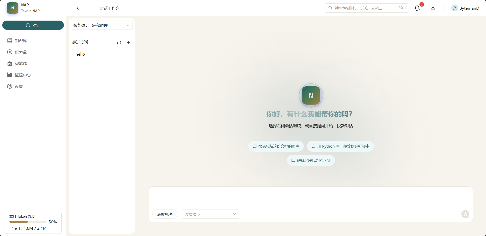

# NAP — Next-generation Agent Platform

> Hand it over while you take a nap.

NAP 是一个轻量级的 AI 智能体与知识库融合平台：支持创建、配置多种智能体并与之对话，同时以知识库驱动检索增强，让每一次回答都有据可依。



---

## 功能概览

| 模块 | 说明 |
|------|------|
| **仪表盘** | 运行状态总览、核心指标统计 |
| **智能体** | 创建 / 编辑 / 删除智能体，配置工具与知识库 |
| **对话工作台** | 流式对话、思考过程可视化、会话管理 |
| **知识库** | 文档上传与 URL 抓取，向量化检索 |
| **监控中心** | Trace 追踪、延迟分布、Token 与成本统计 |
| **设置** | LLM 提供商配置、系统通知管理 |

---

## 技术栈

### 后端

| 技术 | 用途 |
|------|------|
| Python 3.13 + FastAPI | Web 框架，异步接口 |
| SQLModel | ORM，SQLite 持久化 |
| ChromaDB + LangChain | 文档向量化与检索 |
| OpenAI Agents SDK / DeepAgents | Agent 协议与工具调用 |
| SSE（sse-starlette） | 流式响应推送 |
| Loguru | 日志记录 |

### 前端

| 技术 | 用途 |
|------|------|
| Vue 3 + TypeScript | 响应式 UI |
| TDesign Vue Next | 企业级组件库 |
| @tdesign-vue-next/chat | AI 对话组件（消息流、输入框） |
| Pinia | 状态管理 |
| Vue Router | 路由 |
| UnoCSS | 原子化 CSS |
| ECharts（vue-echarts） | 图表渲染 |

---

## 快速开始

### 后端

```bash
cd nap-backend
uv sync                                      # 安装依赖
uv run uvicorn nap.master.asgi:APP --reload  # 启动服务 http://localhost:8000
```

### 前端

```bash
cd nap-frontend
npm install        # 安装依赖
npm run dev        # 启动开发服务器 http://localhost:3000
```

前端开发服务器会将 `/api` 请求代理到后端 `localhost:8000`。

---

## 项目结构

```
next-agents-platform/
├── nap-backend/                # 后端服务
│   └── nap/
│       ├── master/             # FastAPI 入口与路由
│       │   ├── asgi.py         # ASGI 应用注册
│       │   └── api/v1/         # REST 接口模块
│       ├── llm/                # LLM 驱动层
│       ├── knowledge/          # 知识库管理
│       ├── db/                 # 数据库模型
│       └── cmd/                # CLI 命令
├── nap-frontend/               # 前端应用
│   └── src/
│       ├── pages/              # 页面组件
│       ├── components/         # 通用与布局组件
│       ├── stores/             # Pinia 状态
│       ├── api/                # 后端接口封装
│       ├── router/             # 路由配置
│       └── styles/             # 主题与全局样式
├── docs/                       # 文档与截图
└── README.md
```

---

## API 接口

基础路径：`/api/v1`

| 模块 | 路径 | 主要接口 |
|------|------|---------|
| Agents | `/agents` | CRUD + `/{uuid}/chat`（流式对话） |
| Sessions | `/sessions` | 列表、消息历史、删除 |
| Knowledge Base | `/knowledge-base` | CRUD + 文档上传 |
| Knowledge | `/knowledge` | 文档详情与更新 |
| LLMs | `/llms` | 模型提供商配置 CRUD |

---

## 开发

- **后端 CLI**：`uv run nap <command>`（支持 `agent`、`session` 子命令）
- **数据库**：SQLite，位于 `data/` 目录，启动时自动建表
- **向量库**：ChromaDB，位于 `data/chromadb/`